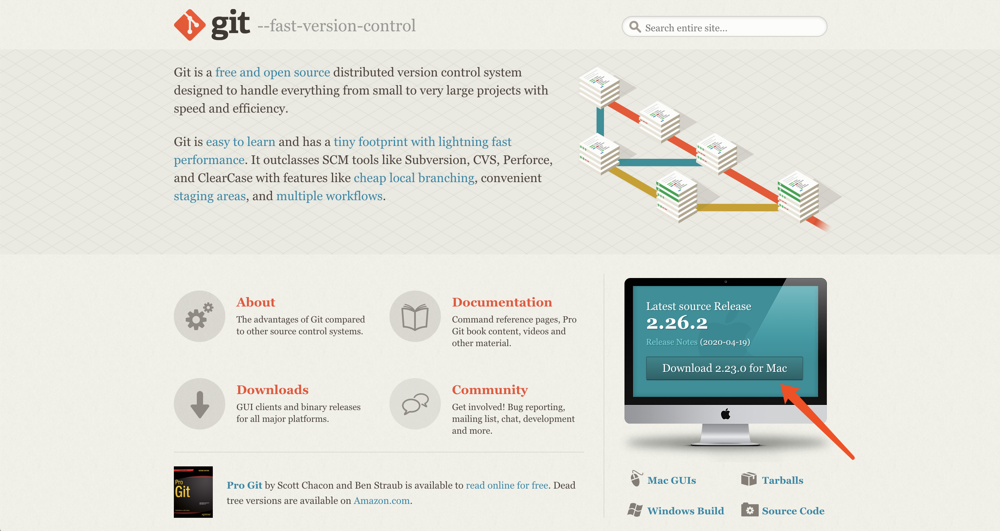
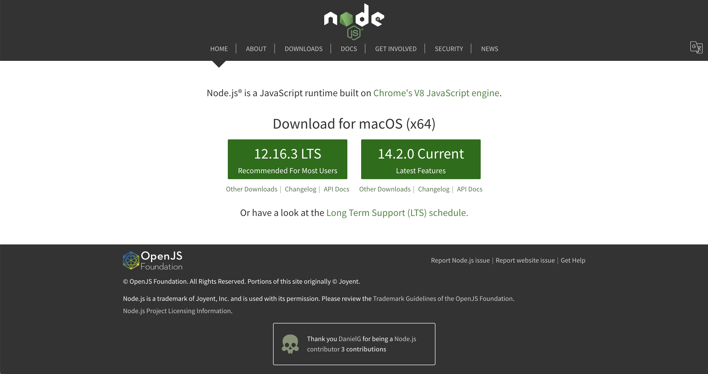
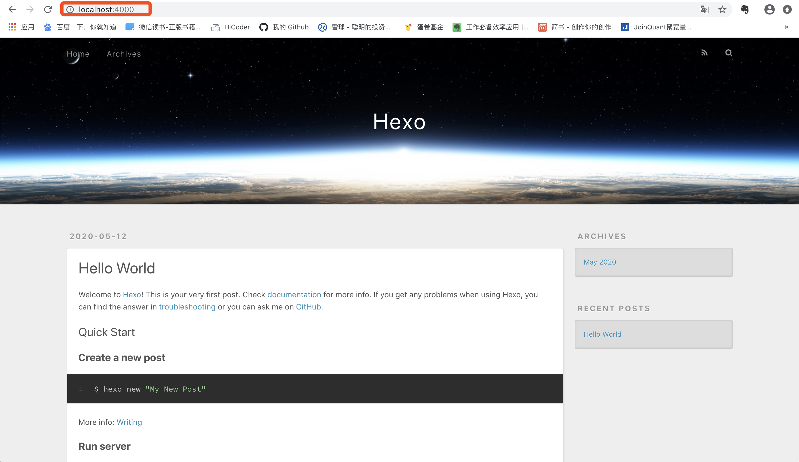

## 环境配置
### 安装 Git
Windows 或 Mac 用户可直接去官网下载，地址为：https://git-scm.com



Linux 用户可使用以下方式来安装：
```shell
Linux (Ubuntu, Debian)：sudo apt-get install git-core
Linux (Fedora, Red Hat, CentOS)：sudo yum install git-core
```


### 安装 Node.js

Node.js 的官方地址为：https://nodejs.org/en/



双击下载包，完成安装。**需要注意的是，如果是 Windwos 用户，在安装的时候使用 Node.js 官方安装程序时，请确保勾选 Add to PATH选项（默认已勾选）。**

### 安装 Hexo

```shell
$ npm install -g hexo-cli
```

安装完 hexo 后，请将 hexo 安装目录下的  node_modules 添加到环境变量。

```shell
echo 'PATH="$PATH:./node_modules/.bin"' >> ~/.profile
```

## 初始化本地环境

### 建站

首先，将命令行定位到目标文件夹地址

```shell
cd 文件夹地址
```

然后初始化这个文件夹

```shell
hexo init
```

启动本地站点，你将会在 shell 中看到一个本地 ip 地址，这就是你本地网站的地址。

```shell
hexo serve
```

> INFO Start processing
>
> INFO Hexo is running at http://localhost:4000 . Press Ctrl+C to stop.

