> 前面使用新注册的账号为大家做了演示，接下来的内容为了集中式管理，我将使用我原有的github账号进行演示。即：本教程 gtihub pages 的地址为`https://github.com/mrshiqiqi/hexo-github`。

### 使用VSCode

首先，我在本地一个叫`hexo-github`的文件夹下初始化了`hexo环境`，如下图：

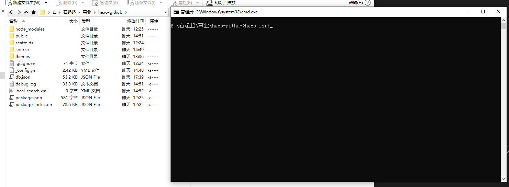

为了方便学习，这里将使用`VSCode`编辑器来**撸代码**。VSCode的下载地址为：https://code.visualstudio.com/，点击`DwonLown`下载即可。


下载完后双击进行安装（不要告诉我你不会安装软件😶）。软件打开如下图：

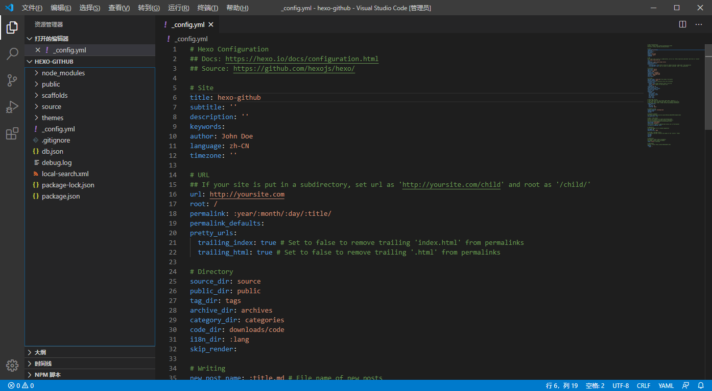

你的界面可能和我的有所不同，别担心，界限来在下面箭头位置点击，然后搜索`Langauge`，安装中文翻译包，你的界面就会变成中文模式了😄，是不是很酷( •̀ ω •́ )✧

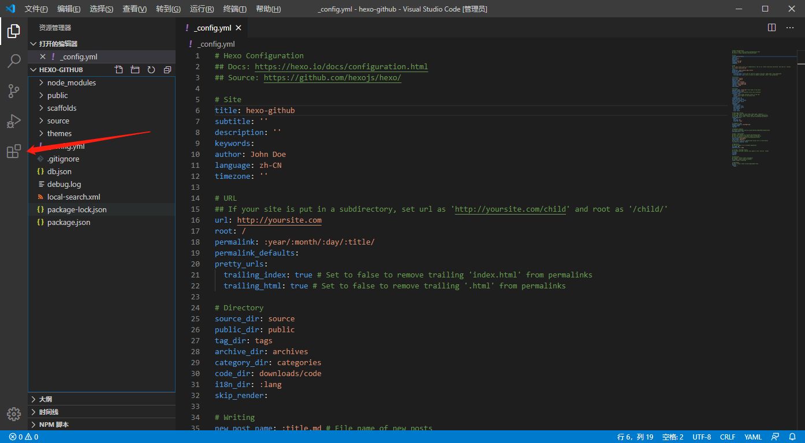

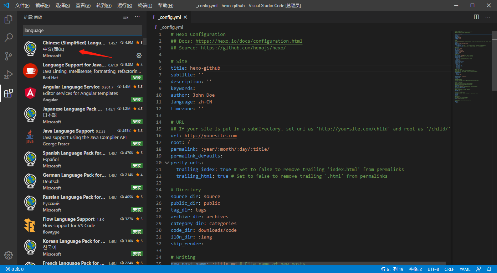

现在，从文件中选择打开文件夹，打开你创建的hexo文件夹，我的是`hexo-github`，也就是上面你看到的样子🤭

在VSCode中打开终端，你就可以执行各种命令行，简直不要太舒服~~o(*￣▽￣*)ブ


### 下载主题

这里给大家推荐一个极简、精致、优雅的主🐖题：**Fluid**.为了避免主题更新导致与教程内容不匹配，这里我暂时将主题Fork到了我自己的仓库中，以保证大家学习的时候三观一致(●'◡'●)

Fulid地址：`https://github.com/mrshiqiqi/hexo-theme-fluid.git`

在VSCode看输入以下命令：

```powershell
git clone https://github.com/mrshiqiqi/hexo-theme-fluid.git themes/fluid
```

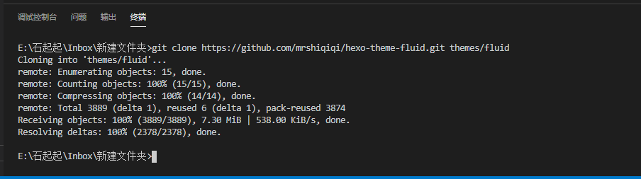


这样，在themes目录下就有fluid内容了。

### 应用主题

在跟目录下的`_config.yml`中，将`theme:`对应的值该为`fluid`，如下：

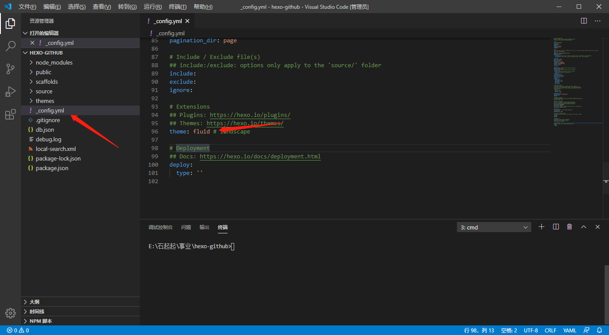

输入`hexo serve`在本地查看效果（按下Ctrl，点击箭头指向的地址，就可以查看了）：

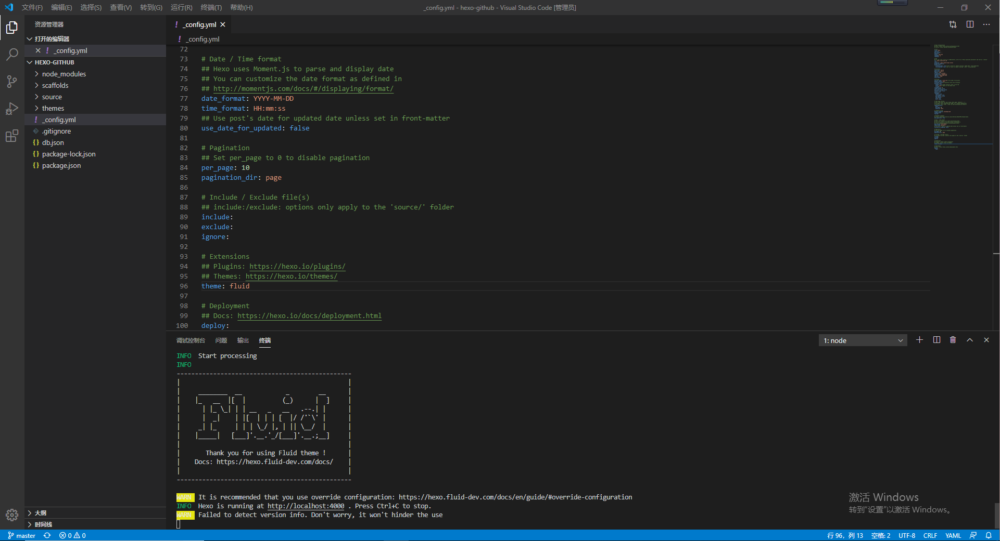

效果：


**看到这里，你应该开心的笑了😀。仰天大笑出门去，小心看路~~**

### 将本地站点推送到Github

安装`hexo-deployer-git`

```po
$ npm install hexo-deployer-git --save
```

> 提示：在终端中按下`ctrl + c`就可以结束网站的运行哦👉

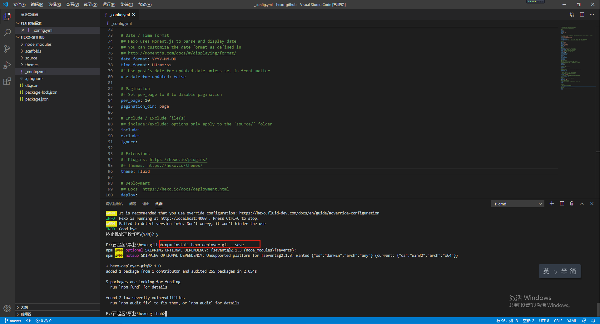

配置远程地址：

先打开你的github仓库

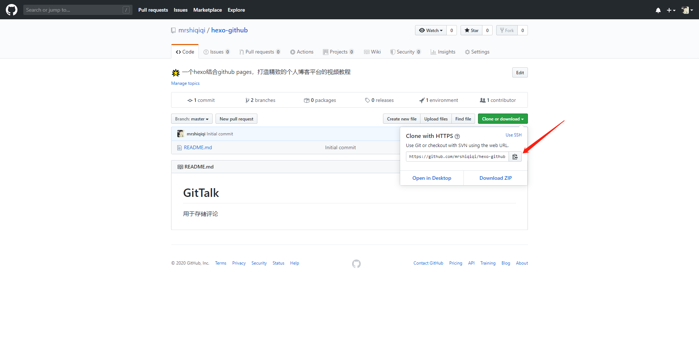

点击`Clone or Download`，复制仓库链接地址。将`_config.yml`中的`deploy`改成如下配置，其中`repo`就是你复制的仓库地址链接

```po
deploy:
- type: git
  repo: 'https://github.com/mrshiqiqi/hexo-github.git'
```

保存后，在终端中输入如下命令：

```po
$ hexo g -d
```

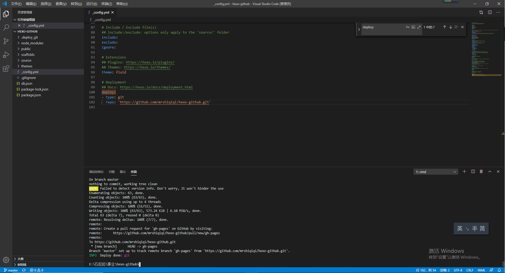

上面的指令会将网站进行编译，然后上传到Github中。

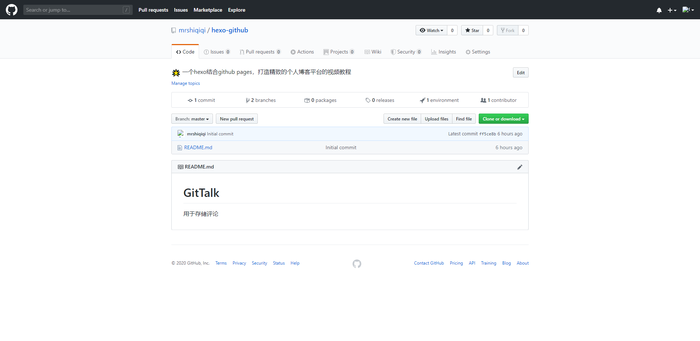

### 访问你的网站

在浏览器中输入：https://hicoder.com.cn/hexo-github/ 后，效果如下（你要换成你自己的github pages地址哦(*^_^*)）


**你已经完成了最难的关卡，给自己一个奖励吧。666~~~👍**


