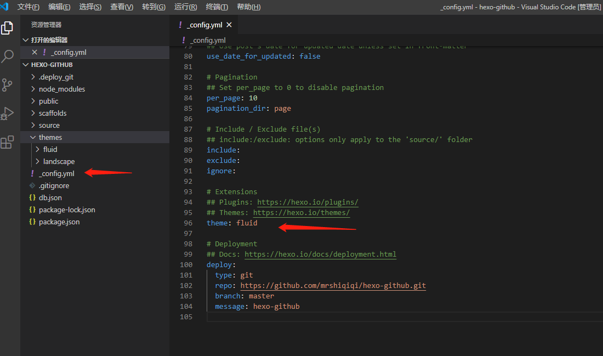
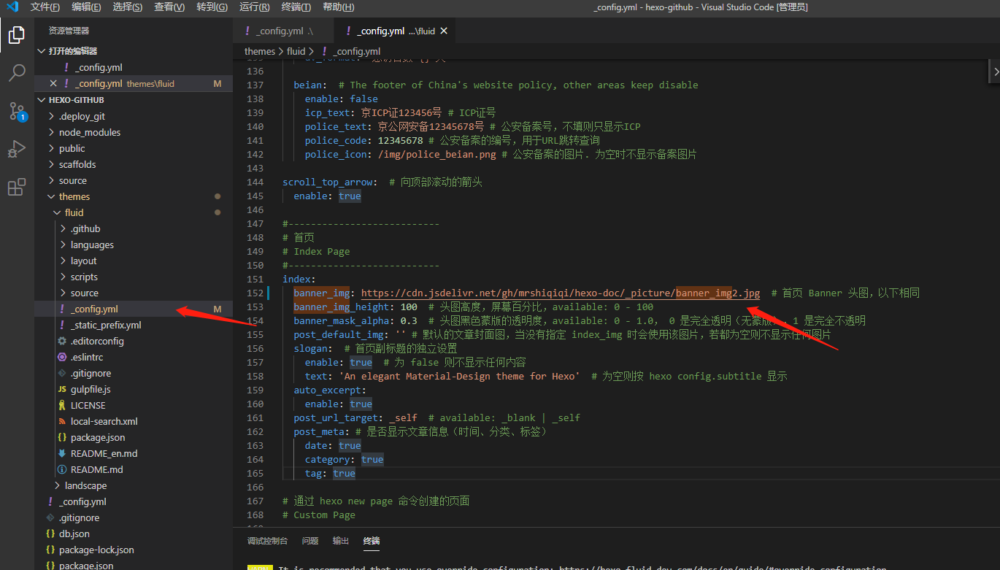

> 本节标题虽然是背景设置，但主要会从网站的全局配置进行讲解哦🤞

### 指定主题

在跟目录人`_config.yml`看，配置如下：

```yaml
theme: fluid  # 指定主题
```



### 背景大图

在主题`fluid`目录下的`_config.yml`中，配置如下：

```yaml
banner_img: https://cdn.jsdelivr.net/gh/mrshiqiqi/hexo-doc/_picture/banner_img2.jpg
```

背景图片可以是本地目录下的，也可以是在线链接。这里附三张在线背景图片：

```yaml
https://cdn.jsdelivr.net/gh/mrshiqiqi/hexo-doc/_picture/banner_img1.jpg
https://cdn.jsdelivr.net/gh/mrshiqiqi/hexo-doc/_picture/banner_img2.jpg
https://cdn.jsdelivr.net/gh/mrshiqiqi/hexo-doc/_picture/banner_img3.jpg
```



### 博客标题


### 菜单栏


### 图片懒加载


### 设置字体


### 网页统计