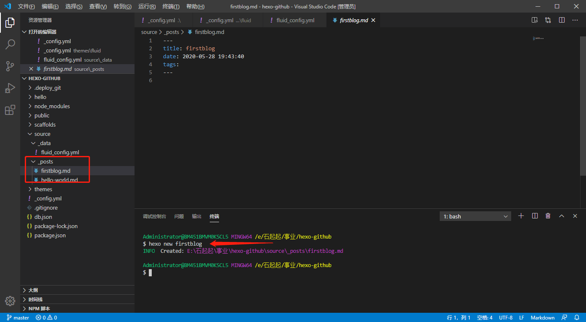
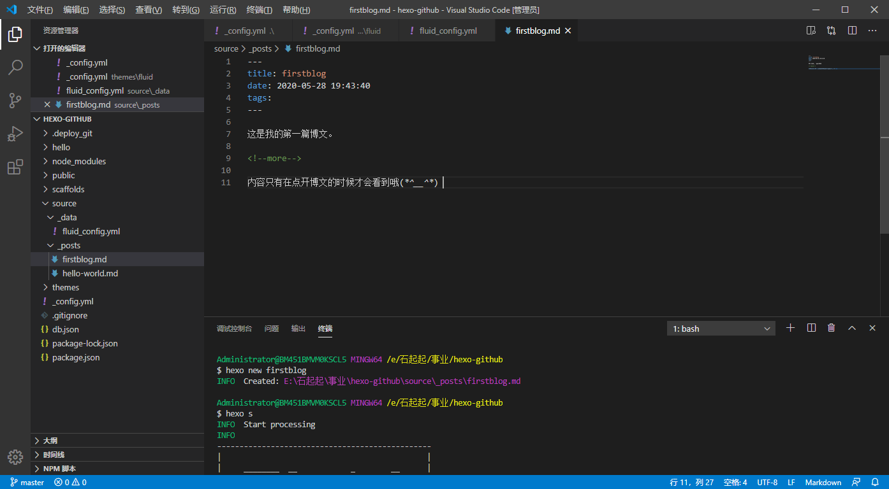
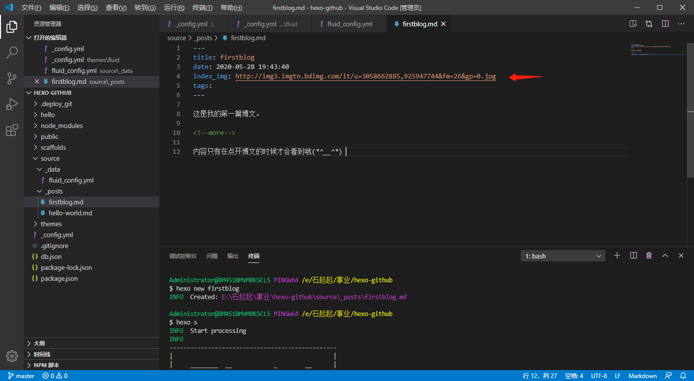
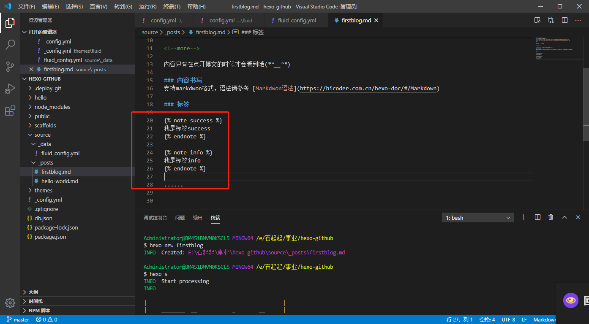
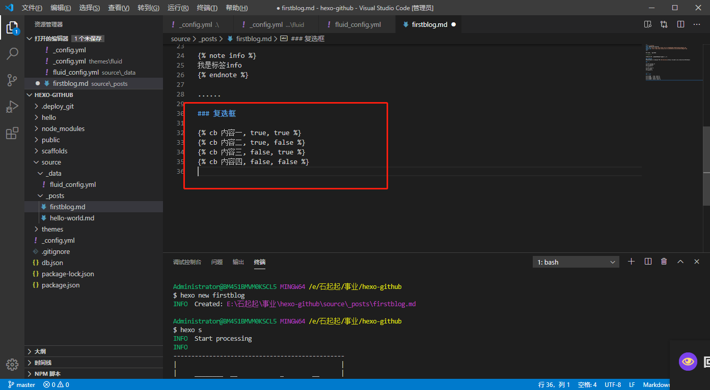
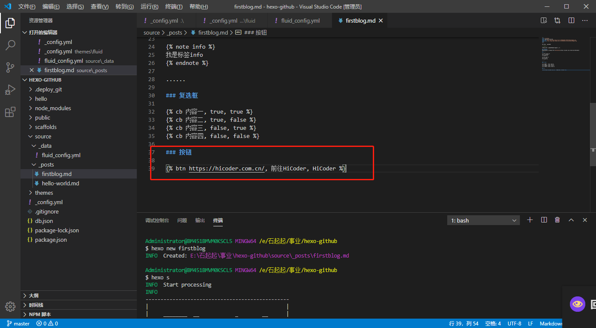
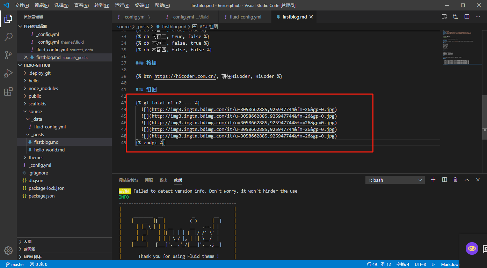
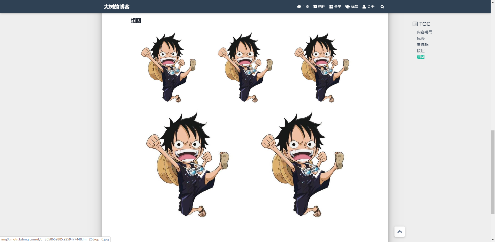
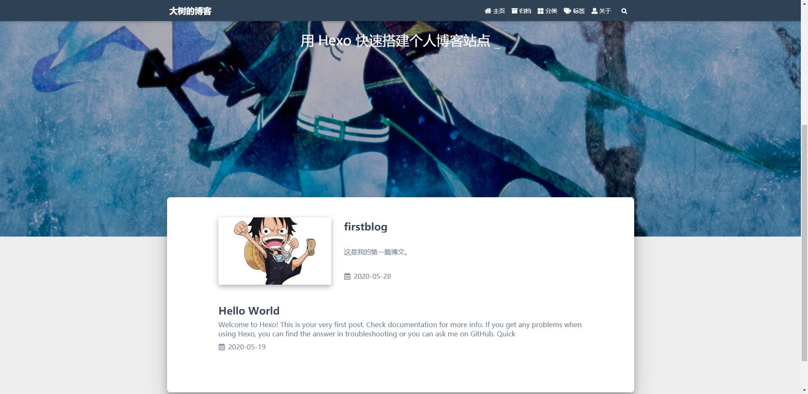
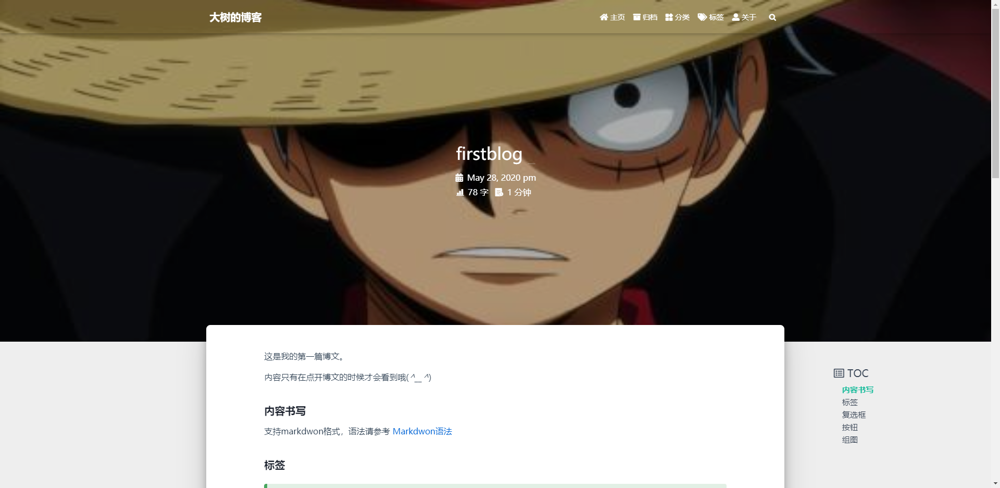

### 新建一篇博文

```yaml
hexo new 博文名称
```

默认创建的新博客文件会放到`source/_posts`目录下。



### 添加文章摘要

```yaml
这里是摘要
<!-- more -->
这里是正文
```



### 文章缩略图

```yaml
---
index_img: /img/example.jpg
---
以下是文章内容
```



### 文章页面顶部大图

```yaml
---
banner_img: /img/post_banner.jpg
---
以下是文章内容
```

### 文章内容

文章内容格式采用`Markdown`格式书写，发布文章的时候，内容会被编程成`Html`格式。关于`Markdwon`语法，请参考[Markdown语法](https://hicoder.com.cn/hexo-doc/#/Markdown)。

### 添加便签

```yaml

文字 或者 `markdown` 均可

```

`note`是标签类型的关键字。支持`primary/default/info/success/warning/danger`几种类型。



### 复选框

```yaml

```

text：显示的文字
checked：默认是否已勾选，默认 false
incline: 是否内联（可以理解为后面的文字是否换行），默认 false



### 按钮

```yaml

```

url：跳转链接
text：显示的文字
title：鼠标悬停时显示的文字（可选）



### 组图

```yaml

  
  
  
  
  

```

total：图片总数量，对应中间包含的图片 url 数量
n1-n2-...：每行的图片数量，可以省略，默认单行最多 3 张图，求和必须相等于 total，否则按默认样式

如下图为 `` 示例，代表共 5 张图，第一行 3 张图，第二行 2 张图。





### 效果展示





