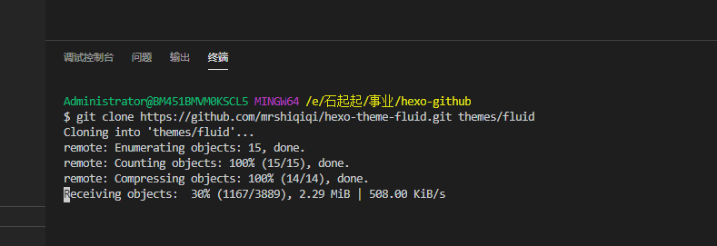
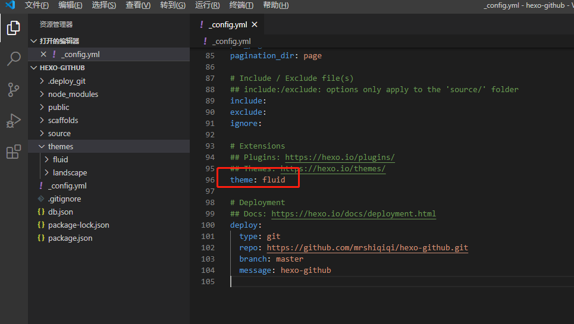
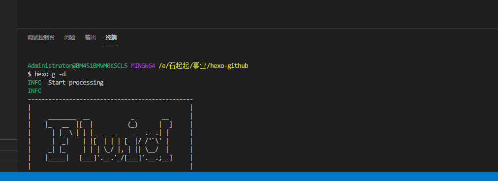

### 下载主题

Hexo默认提供的主🐖题不是很美观，这里给大家推荐一个极简、精致、优雅的主🐖题：**Fluid**.为了避免主题更新导致与教程内容不匹配，这里我暂时将主题Fork到了我自己的仓库中，以保证大家学习的时候三观一致(●'◡'●)

Fulid地址：`https://github.com/mrshiqiqi/hexo-theme-fluid.git`

在VSCode看输入以下命令：

```powershell
git clone https://github.com/mrshiqiqi/hexo-theme-fluid.git themes/fluid
```



这样，Fluid主题就被下载到吧`themes`目录下。

### 应用主题

在跟目录下的`_config.yml`中，将`theme:`对应的值该为`fluid`，如下：



输入`hexo serve`在本地查看效果（按下Ctrl，点击箭头指向的地址，就可以查看了）：


效果：


**看到这里，你应该开心的笑了😀。仰天大笑出门去，小心看路~~**

在终端中运行`hexo g -d`，把你的网站推送到远程站点（Github)上吧💪



### 访问你的网站

在浏览器中输入：https://hicoder.com.cn/hexo-github/ 后，效果如下（你要换成你自己的github pages地址哦😄）


**你已经完成了最难的关卡，给自己一个奖励吧。666👍**